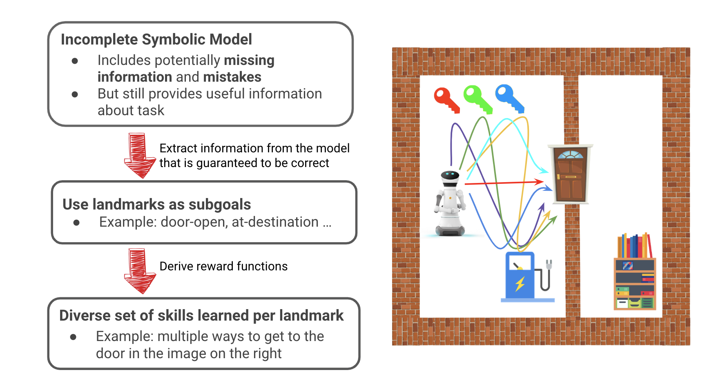
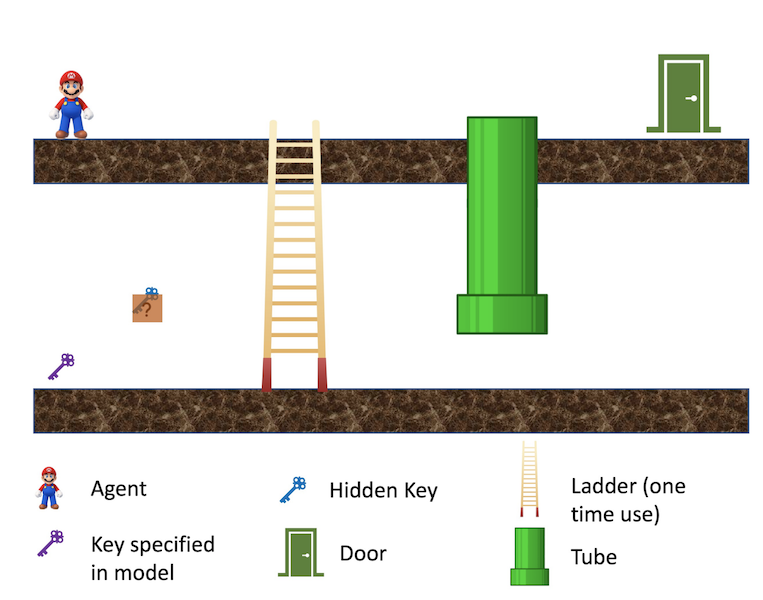

# ASGRL: Leveraging Approximate Symbolic Models for Reinforcement Learning via Skill Diversity
### Official PyTorch implementation of the ASGRL in the ICML 2022 paper: Leveraging Approximate Symbolic Models for Reinforcement Learning via Skill Diversity

**Note**: The code has been refactored for better readability. If you encounter any problem, feel free email lguan9@asu.edu or submit an issue on Github. 

### A. Components of ASGRL
- **Q-Learning Agent**
	- Tabular Q-Learning is used to implement the low-level policy for each skill.
	- File: [q\_learning.py](https://github.com/GuanSuns/ASGRL/blob/main/learning_agents/q_learning/q_learning.py)
- **Diversity Q-Learning**
	- A Diversity-Q-Learning agent maintains a set of skill policies (i.e., a set of Q-Learning agents) to reach the same subgoal.
	- The diversity rewards are computed in this agent.
	- File: [diversity\_q\_learning.py](https://github.com/GuanSuns/ASGRL/blob/main/learning_agents/diversity_q_learning/diversity_q_learning.py)
	- The curriculum-based version can be found in: [curriculum\_diversity\_learning.py](https://github.com/GuanSuns/ASGRL/blob/main/learning_agents/diversity_q_learning/curriculum_diversity_q_learning.py)
- **Hierarchical-Diversity-RL (Meta-Controller)**
	- The Hierarchical-Diversity-RL agent implements the meta-controller.
	- A Hierarchical-Diversity-RL agent maintains a set of Diversity-Q-Learning agents to achieve different subgoals.
	- Given a list of linearizations of landmarks sequence (i.e., a list of subgoal sequences), the Hierarchical-Diversity-RL agent is responsible for finding the right skill to achieve each subgoal and the final goal. Note that given a set of relative landmarks orderings, there could be multiple linearizations of landmark sequences.
	- File: [hierarchical\_diversity\_rl.py](https://github.com/GuanSuns/ASGRL/blob/main/learning_agents/hierarchical_diversity_rl/hierarchical_diversity_rl.py)
	- The curriculum-based version: [hierarchical\_diversity\_rl\_curriculum.py](https://github.com/GuanSuns/ASGRL/blob/main/learning_agents/hierarchical_diversity_rl/hierarchical_diversity_rl_curriculum.py)
- **Summary**
	- A Hierarchical-Diversity-RL agent (Meta-Controller) maintains a set of Diversity-Q-Learning agents
	- A Diversity-Q-Learning agent maintains a set of Q-Learning agents

	
### B. Running the Code
- **Scripts**
	- [q\_train\_mario.py](https://github.com/GuanSuns/ASGRL/blob/main/q_train_mario.py)
	- [q\_curriculum\_train\_mario.py](https://github.com/GuanSuns/ASGRL/blob/main/q_curriculum_train_mario.py)
	- The list of available command line arguments can be found at the class [Agent\_Config](https://github.com/GuanSuns/ASGRL/blob/main/config/__init__.py)
- **Logging**
	- We implement the logging system (in the class [Wandb\_Logger](https://github.com/GuanSuns/ASGRL/blob/main/utils/experiment_manager.py)) with the powerful experiment tracking tool [Weights & Biases](https://wandb.ai).
	- The logging system is only activated when the flag ``--use-wandb`` is added, e.g., ``python q_train_mario.py --use-wandb``

	
### C. Customize the System
- To customize the system, you can take our current code (based on the [Mario](https://github.com/GuanSuns/ASGRL/blob/main/env_mario/env_mario.py) environment) as example. 
- The example config can be found at the [config](https://github.com/GuanSuns/ASGRL/tree/main/config) directory.
- Note that our implementation separates the symbolic planning part and the reinforcement learning part, and this repository only contains the code for the reinforcement learning. So the extracted landmark sequences need to be manually provided in the config class. 
- To apply ASGRL in new environments, you also need to provide the function that tells whether certain subgoal/landmark is satisfied. See the ``check_skill_success`` function in the class ``Hierarchical_Diversity_RL`` or ``Curriculum_Hierarchical_Diversity_RL`` for our Mario domain.

### D. Visualization of the Mario Environment 

