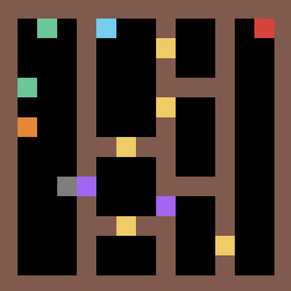

# ASGRL: Leveraging Approximate Symbolic Models for Reinforcement Learning via Skill Diversity
### Official PyTorch implementation of the ASGRL in the ICML 2022 paper: Leveraging Approximate Symbolic Models for Reinforcement Learning via Skill Diversity

**Note**: The code has been refactored for better readability. If you encounter any problem, feel free email lguan9@asu.edu or submit an issue on Github. 

### A. Components of ASGRL
- **Q-Learning Agent**
	- Tabular Q-Learning is used to implement the low-level policy for each skill.
	- File: [q\_learning.py](https://github.com/GuanSuns/ASGRL/blob/main/learning_agents/q_learning/q_learning.py)
- **Diversity Q-Learning**
	- A Diversity-Q-Learning agent maintains a set of skill policies (i.e., a set of Q-Learning agents) to reach the same subgoal.
	- The diversity rewards are computed in this agent.
	- File: [diversity\_q\_learning.py](https://github.com/GuanSuns/ASGRL/blob/main/learning_agents/diversity_q_learning/diversity_q_learning.py)
	- The curriculum-based version can be found in: [curriculum\_diversity\_learning.py](https://github.com/GuanSuns/ASGRL/blob/main/learning_agents/diversity_q_learning/curriculum_diversity_q_learning.py)
- **Hierarchical-Diversity-RL (Meta-Controller)**
	- The Hierarchical-Diversity-RL agent implements the meta-controller.
	- A Hierarchical-Diversity-RL agent maintains a set of Diversity-Q-Learning agents to achieve different subgoals.
	- Given a list of linearizations of landmarks sequence (i.e., a list of subgoal sequences), the Hierarchical-Diversity-RL agent is responsible for finding the right skill to achieve each subgoal and the final goal. Note that given a set of relative landmarks orderings, there could be multiple linearizations of landmark sequences.
	- File: [hierarchical\_diversity\_rl.py](https://github.com/GuanSuns/ASGRL/blob/main/learning_agents/hierarchical_diversity_rl/hierarchical_diversity_rl.py)
	- The curriculum-based version: [hierarchical\_diversity\_rl\_curriculum.py](https://github.com/GuanSuns/ASGRL/blob/main/learning_agents/hierarchical_diversity_rl/hierarchical_diversity_rl_curriculum.py)
- **Summary**
	- A Hierarchical-Diversity-RL agent (Meta-Controller) maintains a set of Diversity-Q-Learning agents
	- A Diversity-Q-Learning agent maintains a set of Q-Learning agents

	
### B. Running the Code
- **Scripts**
	- [q\_train\_mario.py](https://github.com/GuanSuns/ASGRL/blob/main/q_train_mario.py)
	- [q\_curriculum\_train\_mario.py](https://github.com/GuanSuns/ASGRL/blob/main/q_curriculum_train_mario.py)
	- The list of available command line arguments can be found at the class [Agent\_Config](https://github.com/GuanSuns/ASGRL/blob/main/config/__init__.py)
- **Logging**
	- We implement the logging system (in the class [Wandb\_Logger](https://github.com/GuanSuns/ASGRL/blob/main/utils/experiment_manager.py)) with the powerful experiment tracking tool [Weights & Biases](https://wandb.ai).
	- The logging system is only activated when the flag ``--use-wandb`` is added, e.g., ``python q_train_mario.py --use-wandb``

	
### C. Customize the System
- **General Instructions**:
	- To customize the system, you can take our current code (based on the [Mario](https://github.com/GuanSuns/ASGRL/blob/main/env_mario/env_mario.py) environment) as example. 
	- The example config can be found at the [config](https://github.com/GuanSuns/ASGRL/tree/main/config) directory.
	- Note that our implementation separates the symbolic planning part and the reinforcement learning part, and this repository only contains the code for the reinforcement learning. So the extracted landmark sequences need to be manually provided in the config class. 
	- To apply ASGRL in new environments, you also need to provide the function that tells whether certain subgoal/landmark is satisfied. See the ``check_skill_success`` function in the class ``Hierarchical_Diversity_RL`` or ``Curriculum_Hierarchical_Diversity_RL`` for our Mario domain.

- **An Example of Customizing the System for a New Household Environment**
	- An example of how to apply ASGRL on a new environment can be found at [example](https://github.com/GuanSuns/ASGRL/tree/main/example).
	- Note that this new Household environment is more challenging the one(s) in the paper:
		- This new Household env has more rooms, thus making it more difficult to explore.
		- Same as the ones in the original paper, the task of the robot is to go to the destination (i.e., the red block). But the difference is that here the new environment has two locked doors and has some other restrictions.
		- There are three keys. Two of them (i.e., the green ones) can be used to open the corresponding locked door, and one (i.e., the orange one) is only for distraction.
		- Locked doors are marked as purple blocks and unlocked doors are marked as yellow blocks.
		- The robot (i.e., the gray block) can only carry one key at a time. 
		- There is a charging dock (i.e., the blue block). However, the robot needs to wisely choose the timing to recharge itself. More specifically, the robot should only recharge itself after it unlocks the two purple doors and before it enters the final room.
		- Hence, the optimal policy for this task should be: pickup the key for the first locked door, unlock the first locked door, return and pickup the key for the second door, go to unlock the second door, head to the charging dock, go to the final room and perform the final task at the destination.
		- We assume the human knows the structure of this task but doesn't know there are multiple keys. So the extract landmark sequence is: ``pickup-first-key``, ``unlock-door-0``, ``pickup-second-key``, ``unlock-door-1``, ``recharge``, ``at-final-room``, ``at-destination``.
		- We also provide a reference implementation of the baseline [Landmark-Shaping](https://github.com/GuanSuns/ASGRL/blob/main/example/run_landmark_shaping_baseline.py) and [Vanilla Q-Learning](https://github.com/GuanSuns/ASGRL/blob/main/example/run_q_baseline.py) (Note that the code has been refactored for better readability, please contact the authors if you encounter any runtime problem). 
		- We ran each algorithm for around 10 times (not a formal experiment). The vanilla Q-Learning never succeeded within 500k env steps, highlighting the need for human symbolic guidance. The Landmark-Shaping never succeeded either. It is biased by the shaping rewards and it gets stuck on several local minima, such as always picking up the nearest (wrong) key, or always heading to the final room without recharging itself.
		- ASGRL managed to solve the task for 6 times (out of 10). We observed some factors that negatively affect the performance: (a) There were a couple of times when ASGRL found a goal-achieving policy for a while, but then as training proceeded, it forgot about this goal-achieving policy and eventually converged to a "bad" policy. One possible reason for this is that the meta-controller failed to adapt effectively to changes in low-level skills. (b) Some easier-to-learn skills already converge before some preceding skills discovered new low-level subgoal state(s).

### E. Visualization of the New Household Env (More Challenging)
	

### F. Visualization of the Mario Env 

